=======================
Social network accounts
=======================

After configuring the social network plugins, you need to configure what social network accounts you want to submit posts to.

Click "Accounts" on the left submenu of CM Social Post to access account list.

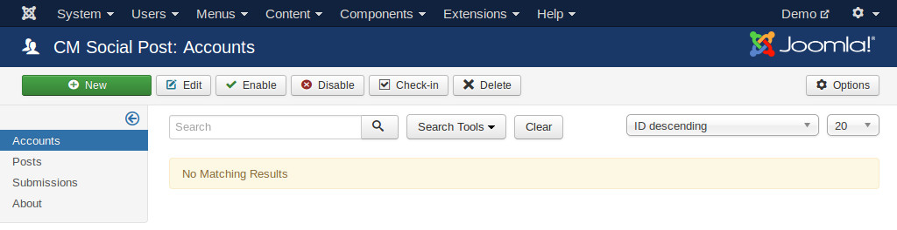

Click "New" button on the toolbar to create a new account.

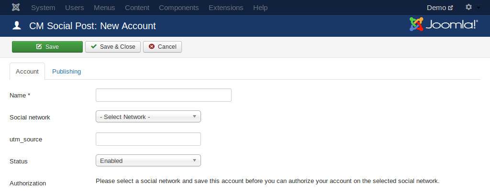

If you want to track clicks for the posts of the current social network account in Google Analytics, you enter UTM source paramenter in "utm_source" option.

Facebook page
-------------

To create an account for Facebook page, you select "Facebook (Page)" in "Social network" option.

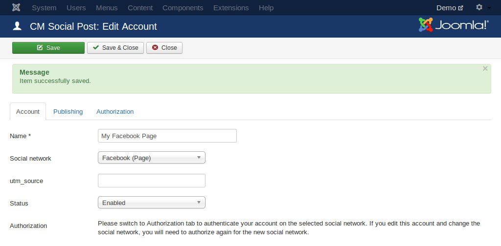

Switch to "Authorization" tab, click "Get pages" button to retrieve the pages which you manage.

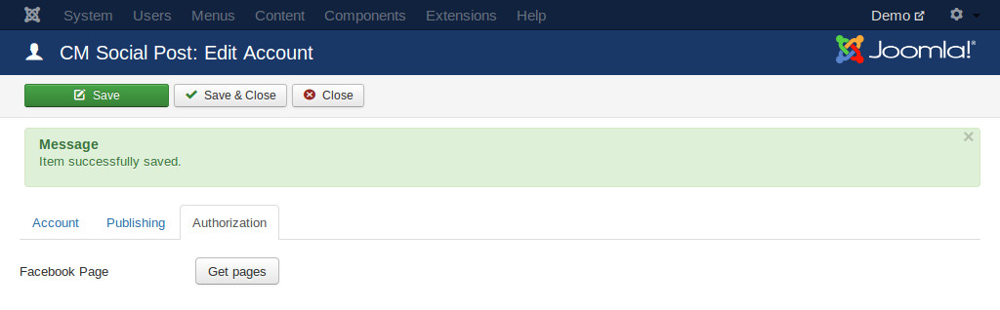

Click "Ok" in the next steps to give your application permissions to retrieve your pages and your info. You can ignore the "Submit for review" message because you don't publish your application for other people to use.

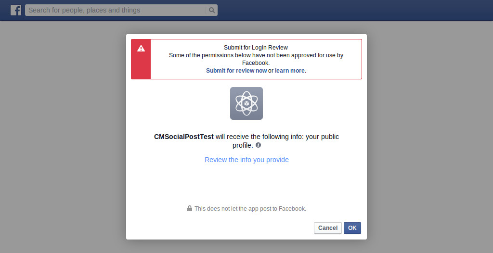
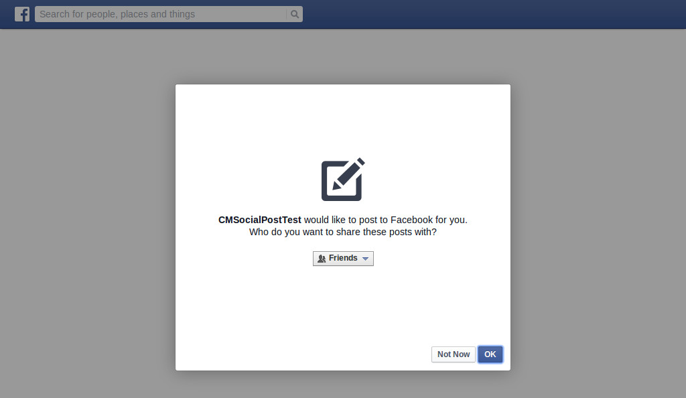
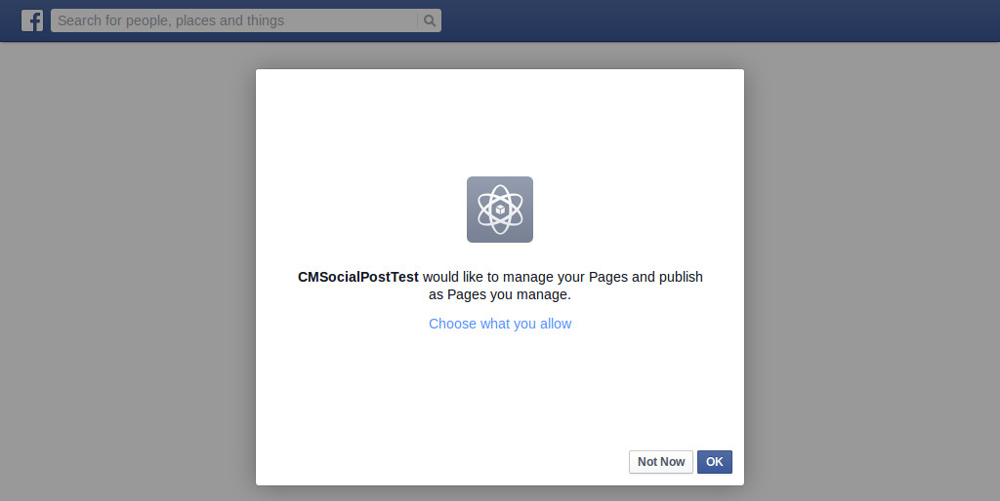

After being redirected back to your Joomla! webiste, you select one of your Facebook pages then save the account.

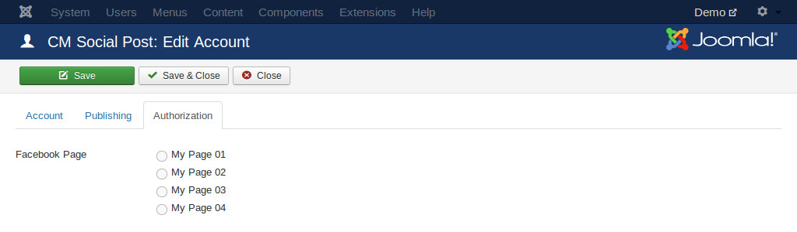

The current selected page is displayed in "Authorization" tab, to switch to other Facebook page, you click "Get pages" button to get your pages and select a new one.

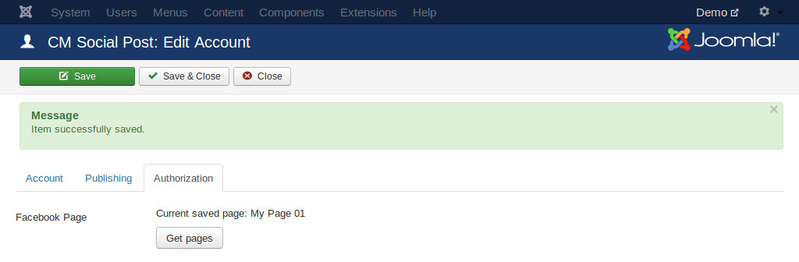

Facebook personal
-----------------

To create an account for Facebook personal account, you select "Facebook (Timeline)" in "Social network" option.

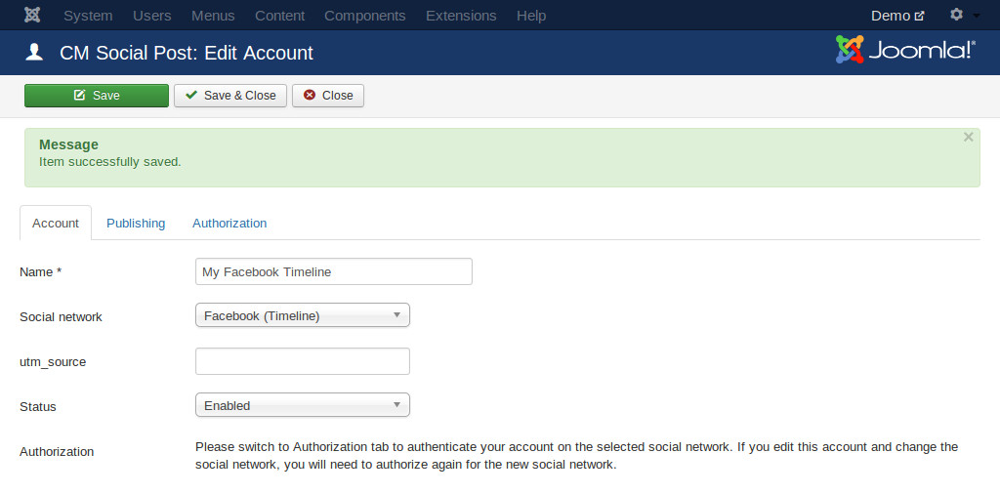

Switch to "Authorization" tab, click "Authorize" button to authorize your Facebook account.

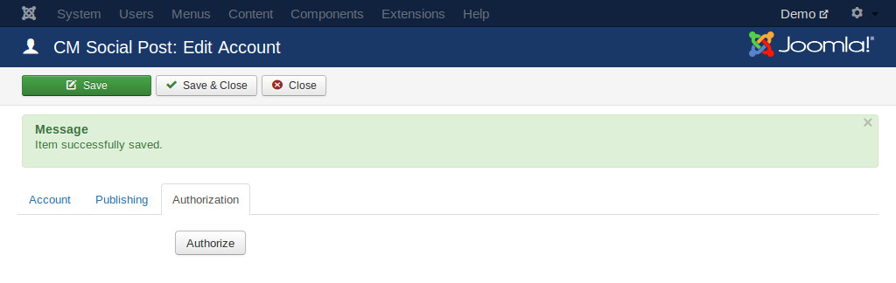

Click "Ok" in the next steps to give your application permissions to retrieve your info. You can ignore the "Submit for review" message because you don't publish your application for other people to use.

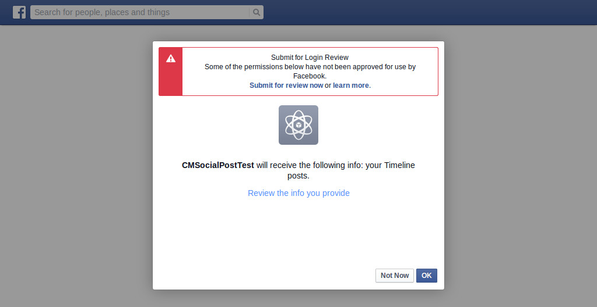

If your current logged-in Facebook account is not the account you used to create your Facebook application, you can see this error:

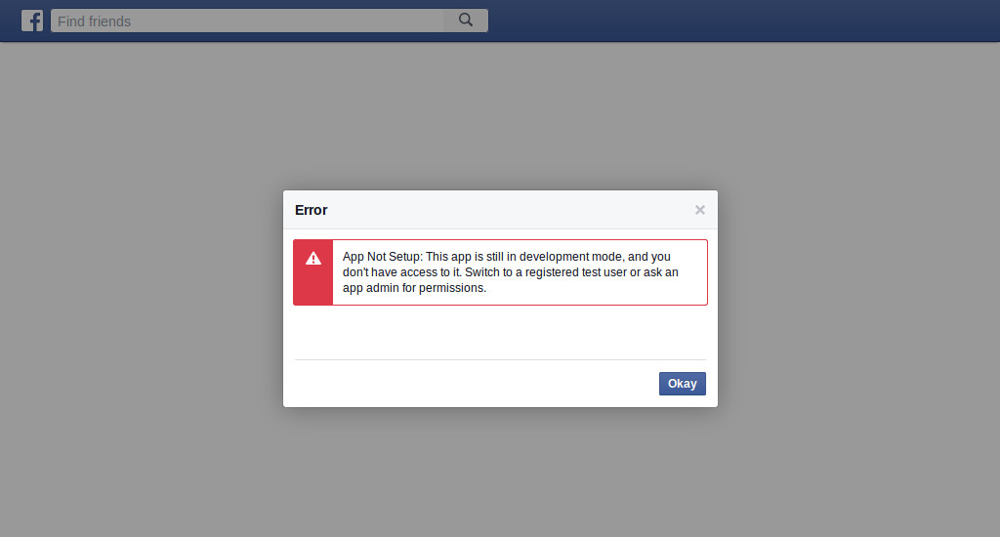

To fix this issue, you go to your application's dashboard, click "Roles" in the left menu.

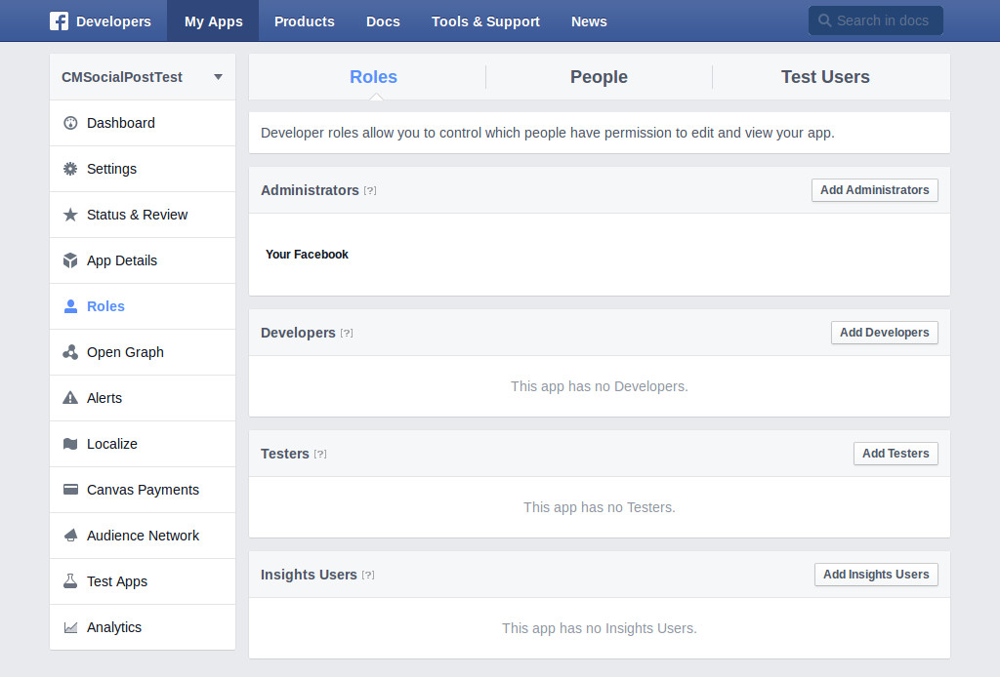

Add the Facebook personal accounts which you want to allow them to use your application as testers.

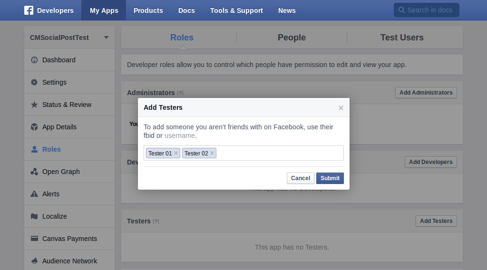

Go back to Joomla! and authorize, then save the account.

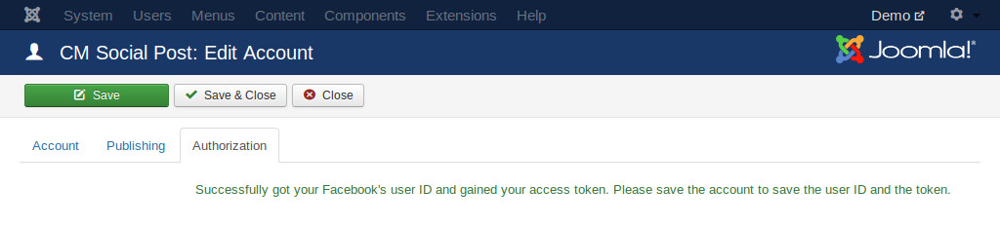

Twitter
-------

To create an account for your Twitter account, you select "Twitter" in "Social network" option.

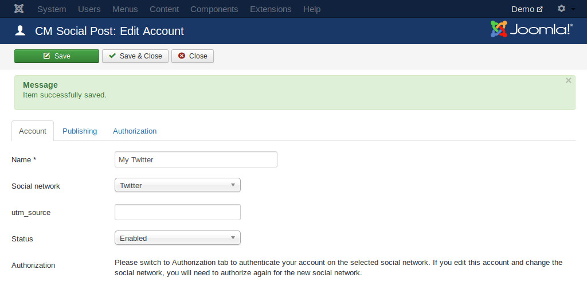

Switch to "Authorization" tab, click "Authorize" button to authorize your Twitter account.

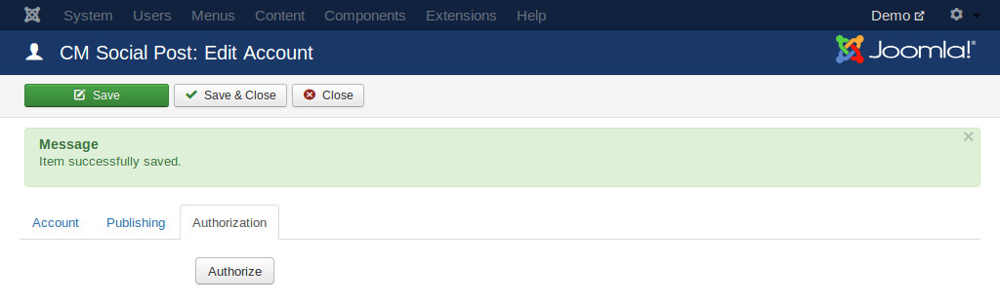

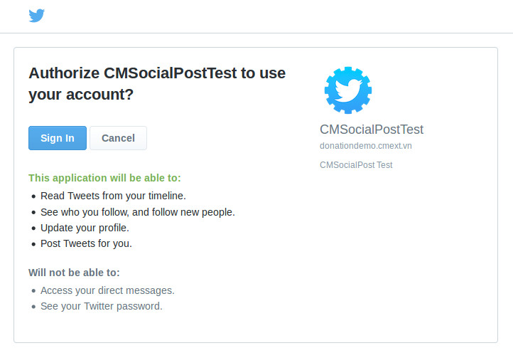

After authorization, you save the account to save your access token.

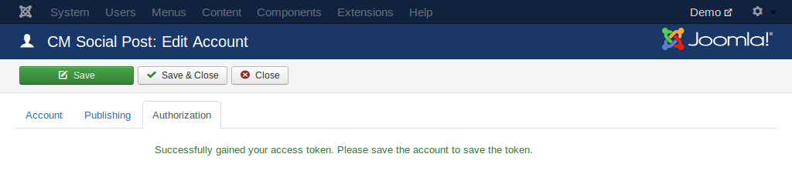