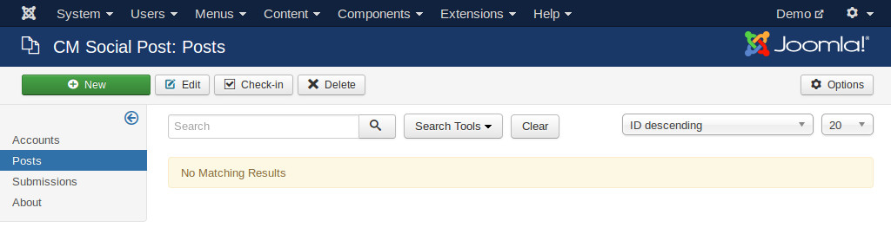

=======================
Component configuration
=======================

In your Joomla! back-end, click "CM Social Post" under "Components" menu item. The default page is the list of posts.

Click "Options" button on the toolbar to access the component's configuration.

Post list
---------

* **Message limit**: Truncate message in post list if message's length is longer than this limit.

Statistics
----------

* **Update interval (minutues)**: Update statistics of a social network's post (likes, shares,...) if its last updated time is older than this update interval value from the current time.

UTM tracking
------------

Settings for the default Google Analytics UTM tracking's parameters in post's link. You can override the UTM parameters for every post.

Cron job
--------

* **Key**: This key is string which is included in your cron job's URL. It is for ensuring you are the only one who can run cron job. The cron job URL looks like::

    http://www.yoursite.com/index.php?option=com_cmsocialpost&task=submit&key=YOUR_KEY_HERE.