====================
Facebook application
====================

To post to Facebook, you need to have a Facebook application. Follow the following steps if you need to create one.

1. Go to `https://developers.facebook.com/ <https://developers.facebook.com/>`_, under menu item "My Apps" you click "Add a New App".

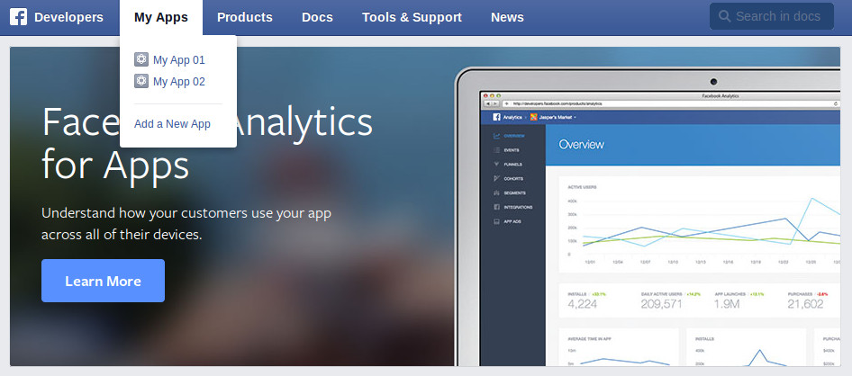

2. Select "Website" in the popup.

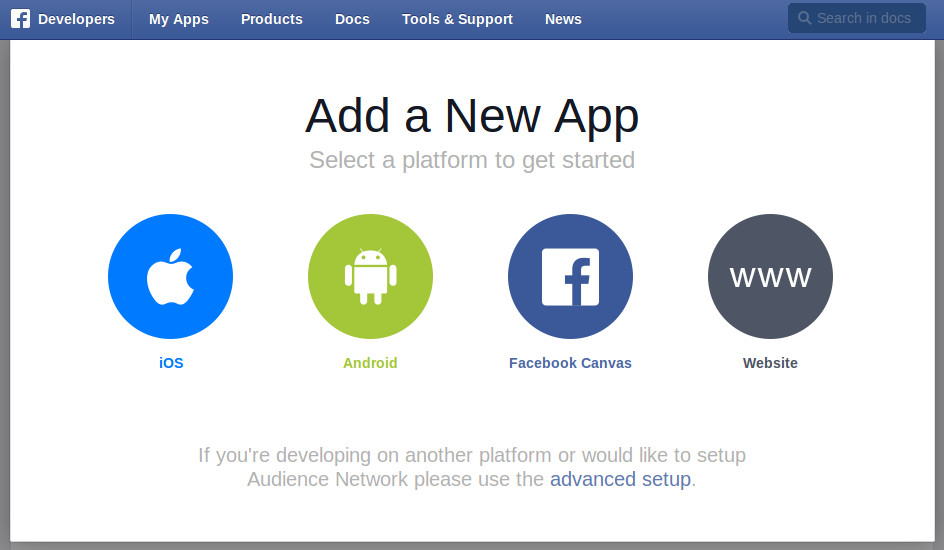

3. Enter your application name and click "Create New Facebook App ID".

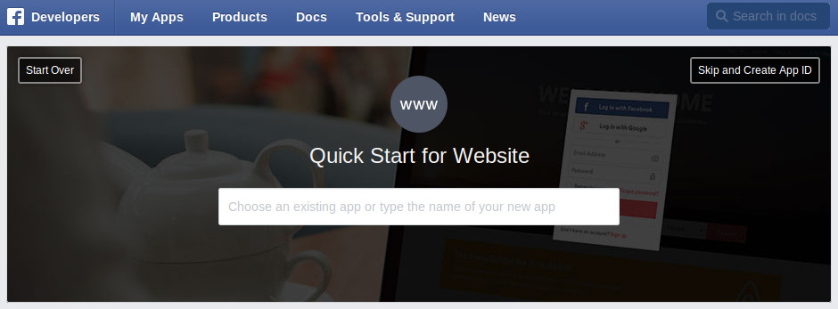

4. Select a category, click "Create App ID" button.

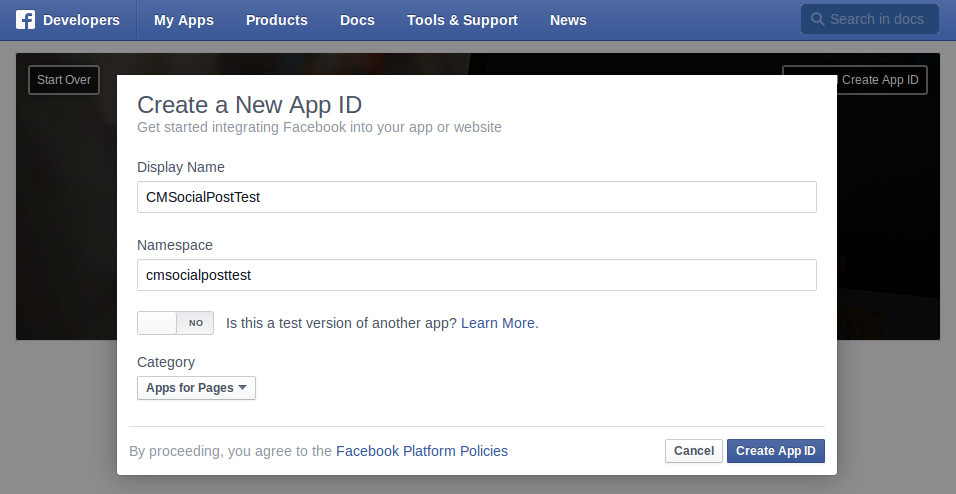

5. Click "Settings" on the left side menu.

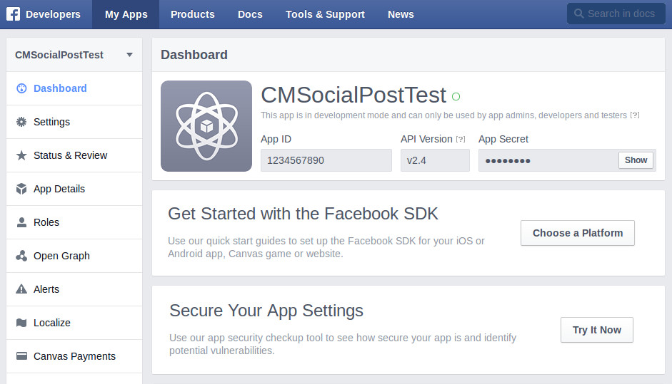

6. Click "Add Platform" button.

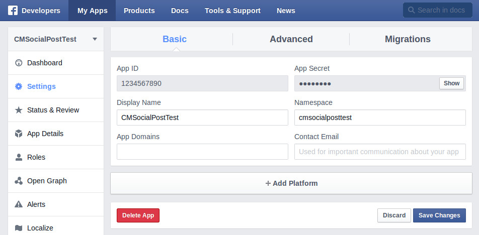

7. Select "Website".

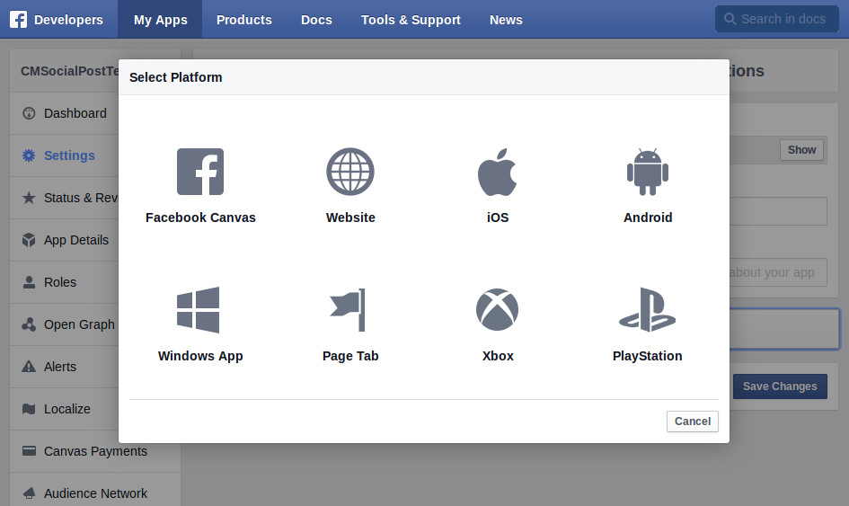

8. Enter your Joomla! website's URL.

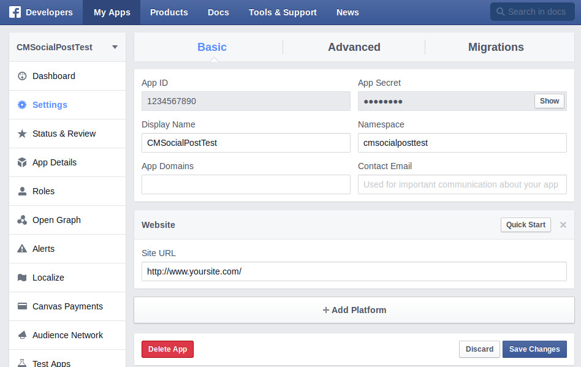

9. Switch to "Advanced" tab, you see a message about "OAuth redirect URIs"

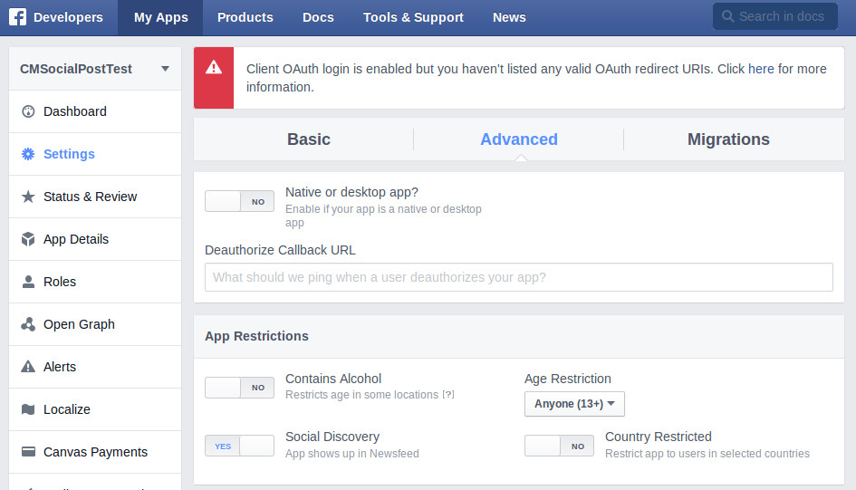

10. Scroll down and enter your website's URL into "Valid OAuth redirect URIs" field.

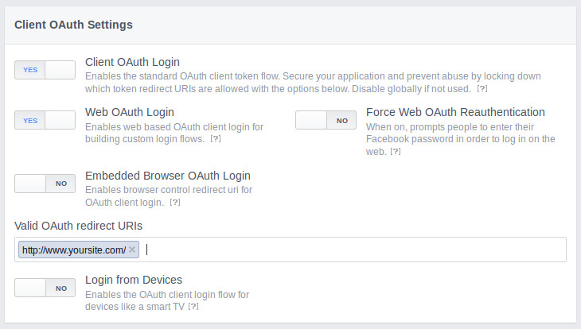

11. Facebook has a feature to include app's secret to API calls for security, CM Social Post is compatible with this feature, you can set "Require App Secret" to "Yes" if you want enable this feature for your application.

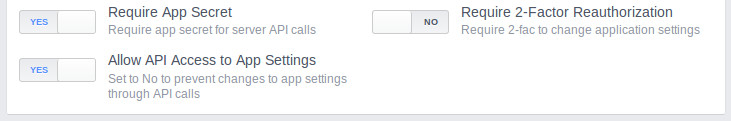