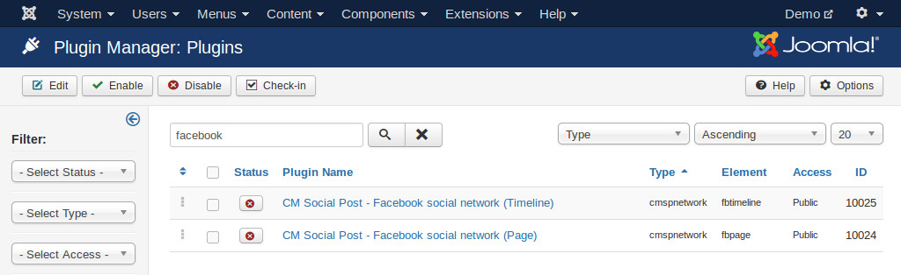
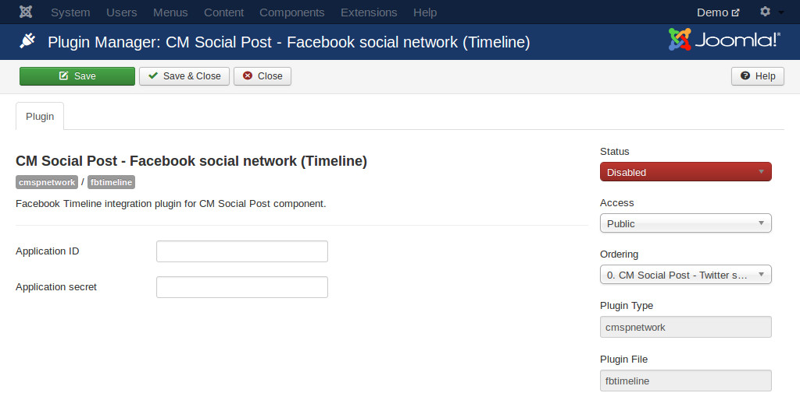

=============================
Facebook page timeline plugin
=============================

To be able to post to a page's timeline, you need to enable "CM Social Post - Facebook social network (Page)" plugin.

In your back-end, go to Extensioins -> Plugins, search for "Facebook", click "CM Social Post - Facebook social network (Page)" plugin to edit its settings.

Enter your application ID and your application secret into the fields, enable the plugin and save.

You can find your application ID and secret in your application's dashbard. To get application secret you need to click "Show" button then enter your Facebook's password.

.. image:: ../images/facebook_app_05.jpg
