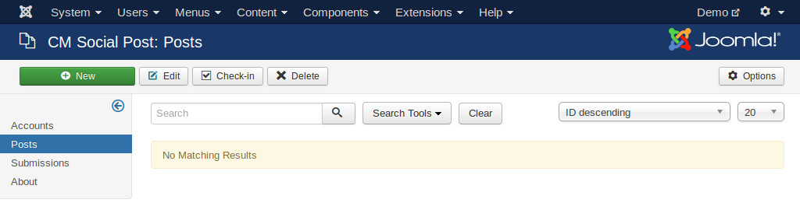
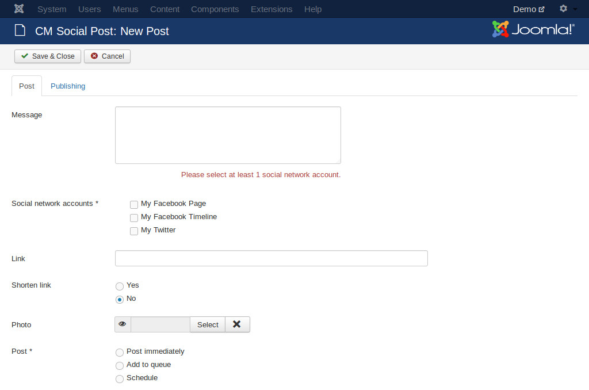
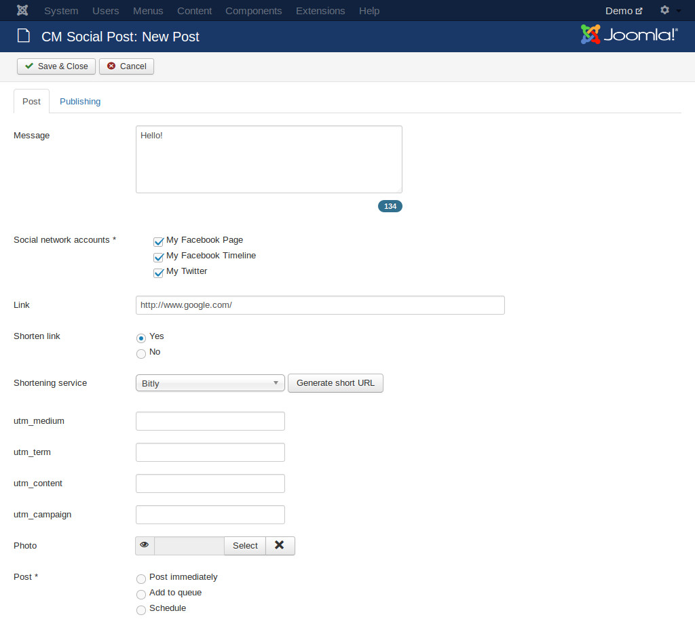
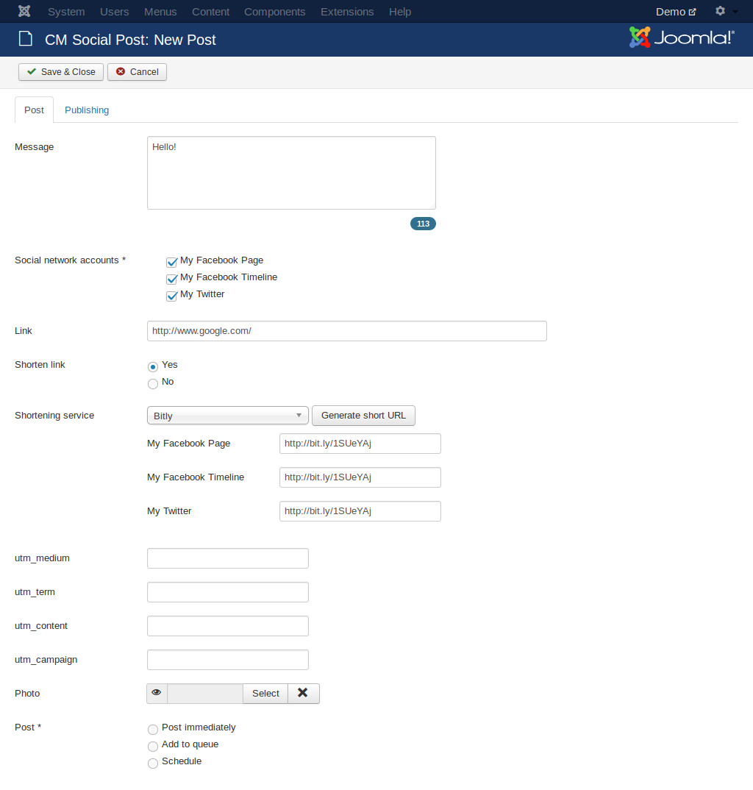
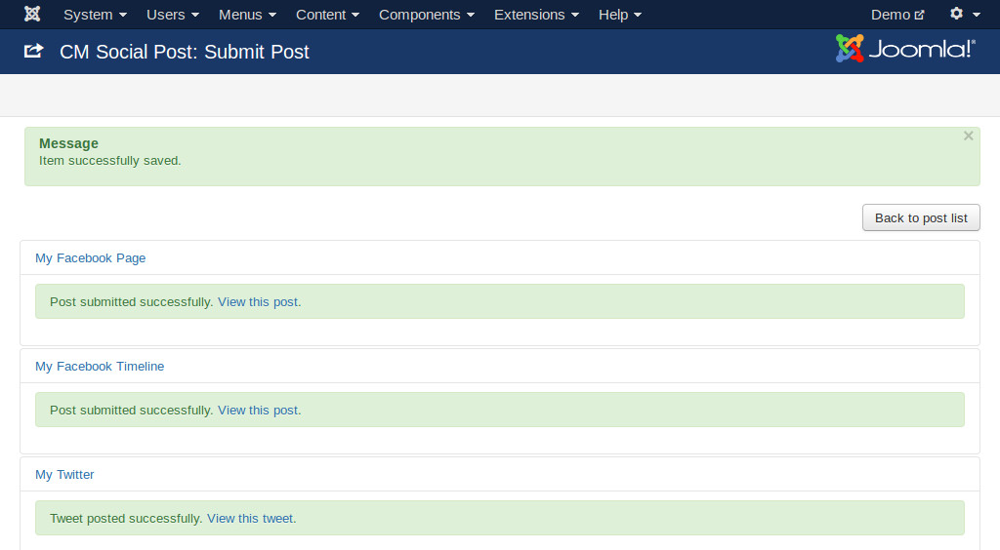
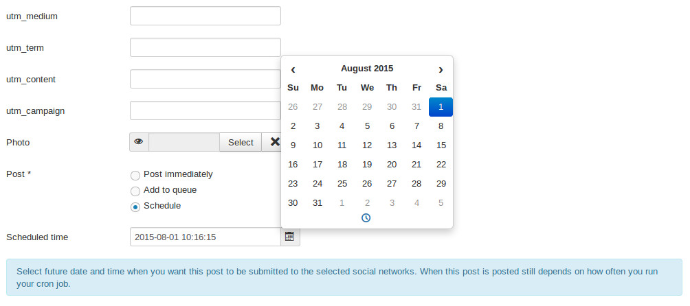
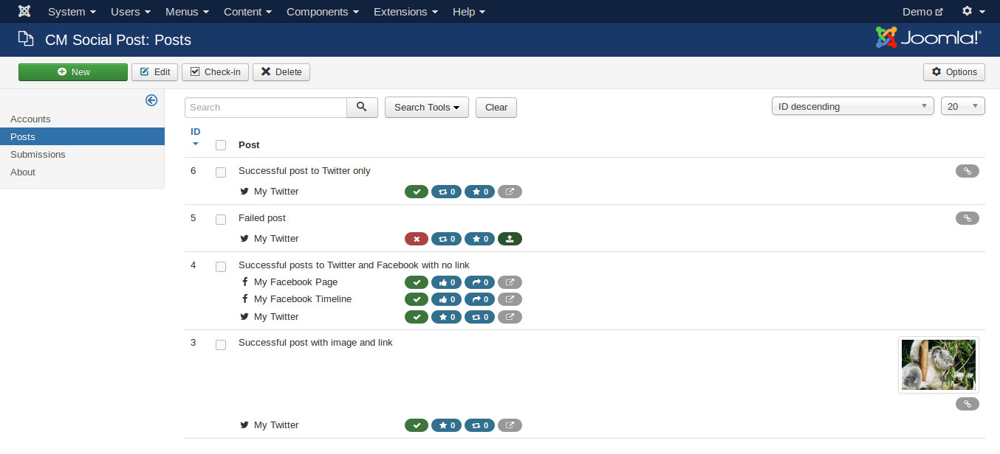

=====
Posts
=====

Create new post
---------------

To post to social network accounts, you click "Posts" menu item in the left submenu.

Click "New" button on the toolbar to create a new post.

Select the social network account you want to post to in "Social network accounts" option. Enter the message you want to post to social networks in "Message" field. Because every social networks has a limitation for message length, so the maximum characters you can enter for your message depends on the selected social networks.

If you want to attach a photo, select your photo in "Photo" option.

If you want to include a link in your post, you enter the link into "Link" field. If you want to shorten the link before submitting your post, you set "Shorten link" option to "Yes". There are another option displayed for selecting what URL shorten service you want to use.

If you want to add UTM tracking parameters to your link before shortening it, you enter them into "utm_term", "utm_content", "utm_campaign" and "utm_medium" fields. utm_source is set in social network accounts.

Click "Generate short URL", shorten URLs for every selected social network accounts will be created with UTM parameters included.

In "Post" option, select "Now" if you want to submit your post to social networks immediately, after you save your post, it will be sent to social networks.

If you select "Schedule", you need to select when you want to post.

Note that your post is sent at the selected date and time or not depends on how often your cron job runs. For example if you configure to submit your post at 10:10 and you configure for your cron job to run every 15 minutes, then your post will be submitted at 10:15, not 10:10.

If you select "Add to queue", your post will be submitted the next time your cron job runs.

Post list
---------

The post list contains the posts that you create and the status of its submissions to the selected social networks.

For every submission, there are 4 columns of icons next to the account name:

* The first column is the status of the submission, successful or failed.
* The second column is the number of "likes" for this post. Depending on social networkm the name of this statistic is different, for Facebook it is "Like", for Twitter it is "Favourite".
* The third icon is the number of "shares" for this post. This is "Share" for Facebook and "Retweet" for Twitter.
* If the post is submitted successfully, the forth icon is a link which opens the post in a new web browser. If the post's submission is failed, the forth icon is a link which you can use to resubmit the post.

On the right edge of the post list, there is a link icon displayed if you add a link to your post, there is also an image displayed there if you include image in your post.