===================
Shortening services
===================

If you want to include a long URL to your post, you can't submit your post to Twitter if your post's length is longer than Twitter's 140 characters limitation. A long URL could also make your post not look good.

CM Social Post gives you ability to shorten your link before submitting to social networks. You can also include Google Anylytics parameters to the URL before shortening, so you can track the sources of the visits from social networks.

There are 2 shortening services supported: is.gd and Bitly. Every service is a Joomla! plugin which is installed automatically when you install the package of CM Social Post.

Bitly
-----

1. To use Bitly you need to go to `https://www.bitly.com/ <https://www.bitly.com/>`_ to create a new account.

2. After logging in you go to `https://dev.bitly.com/ <https://dev.bitly.com/>`_ to create a new application.

3. You click "My Apps" in the top menu.

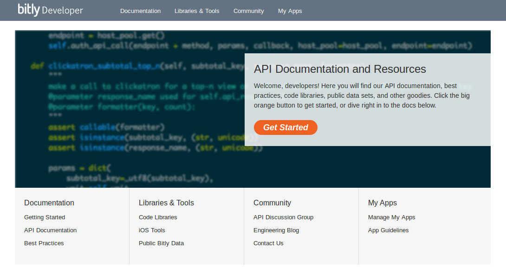

4. Click "Manage My Apps".

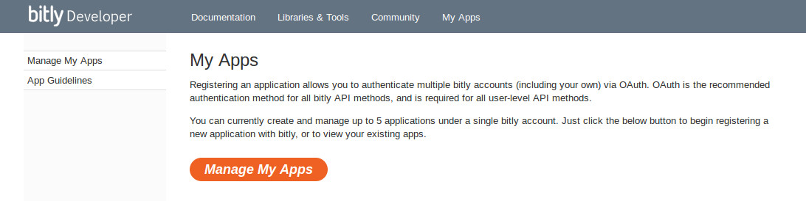

5. Click "Register an application".

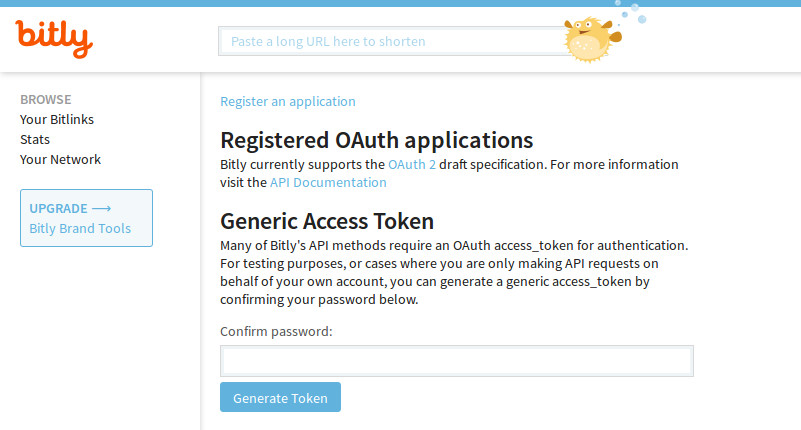

6. Click "Get Registration Code" button. 

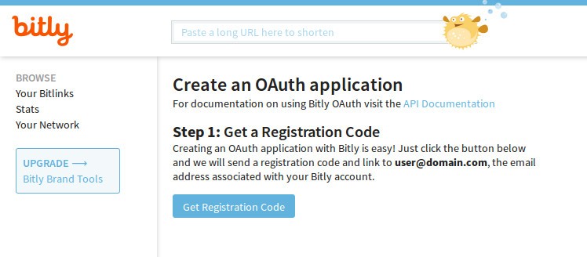

7. Registration code is sent to your email address.

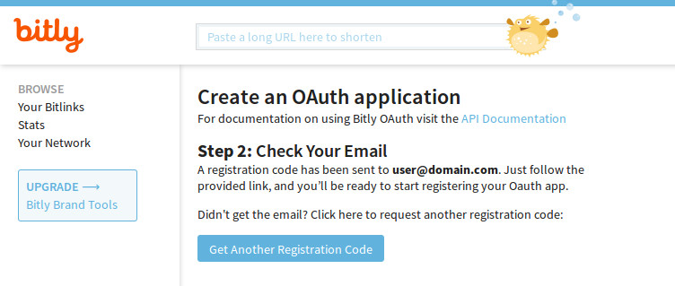

8. Click the link in the email Bitly, you are taken to the form to finish creating your application. Enter your application's name and description, your Joomla! site's URL into the form.

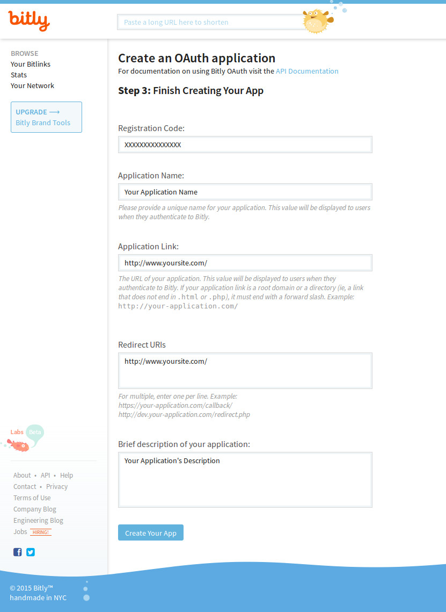

9. After creating application, you are given client ID and client secret. Enter your account's password and click "Generate Token" button to generate a generic access token.

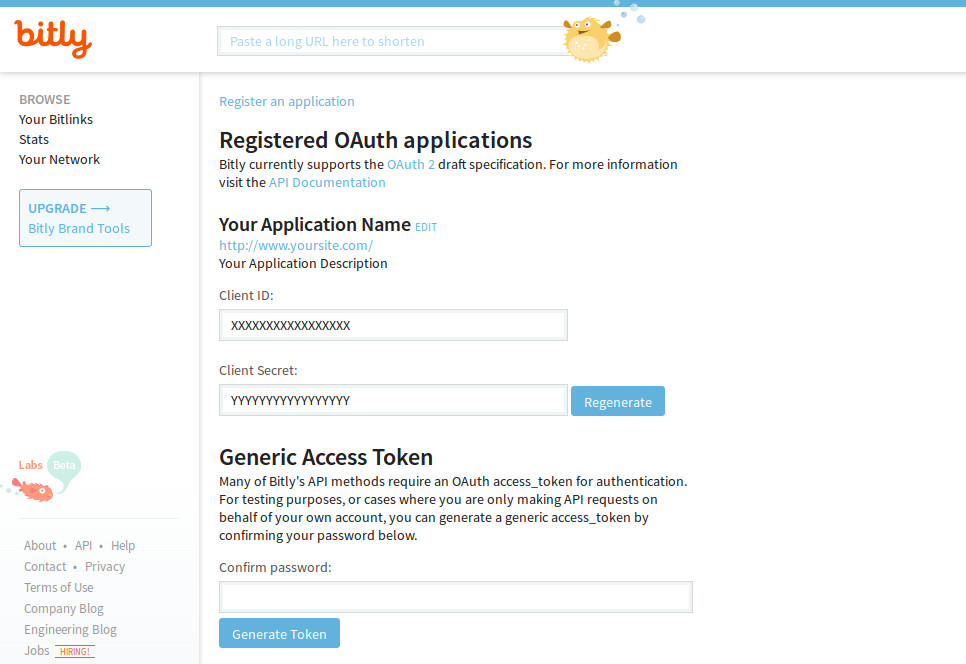

10. Now you have client ID, client secret and generic access token, you enter these values into CM Social Post's Bitly Joomla! plugin.

11. Go to Extensions -> Plugins, search for "bitly", click on the plugin's name "CM Social Post - Bitly shortening service" to edit its settings.

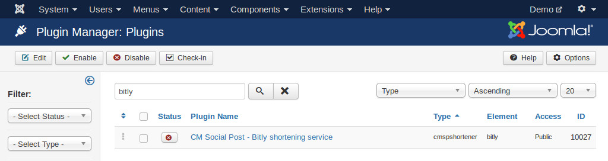

12. Enter your client ID, client secret and generic access token. Select the Bitly's domain which you want to use. If you setup Bitly to use your own domain, enter your domain in "... or use a custom domain" field.

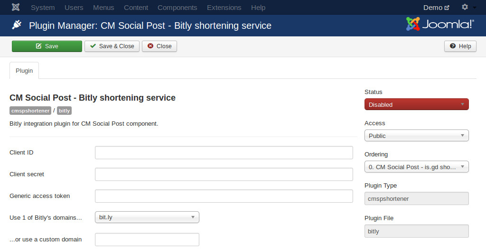

is.gd
-----
Go to Extensions -> Plugins, search "CM Social Post - is.gd shortening service".

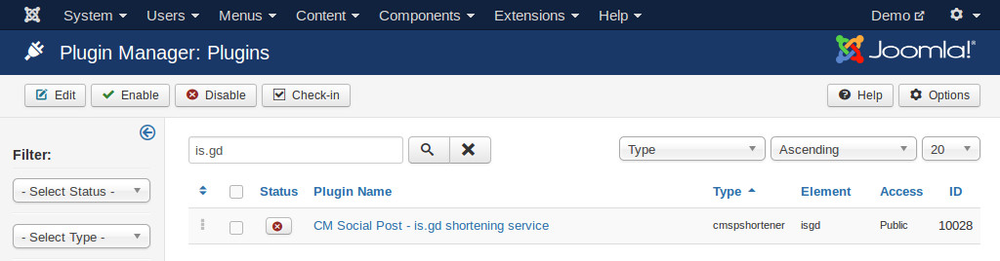

In the plugin's setting form, you select the domain you want to use in "Domain" option.

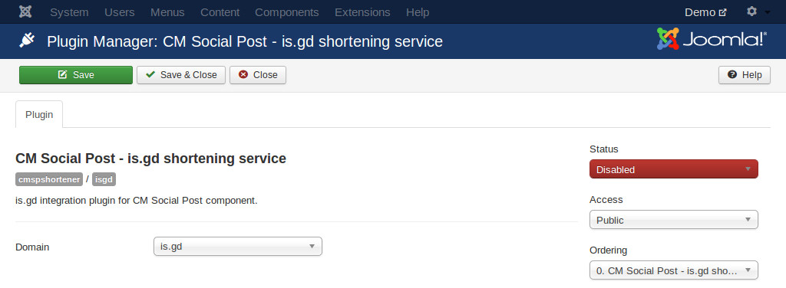