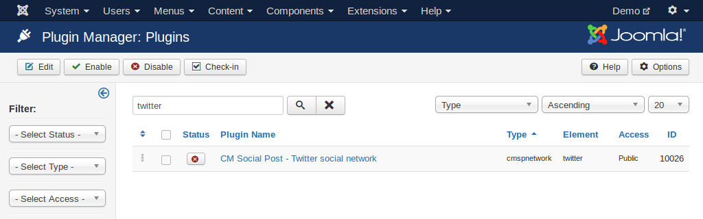
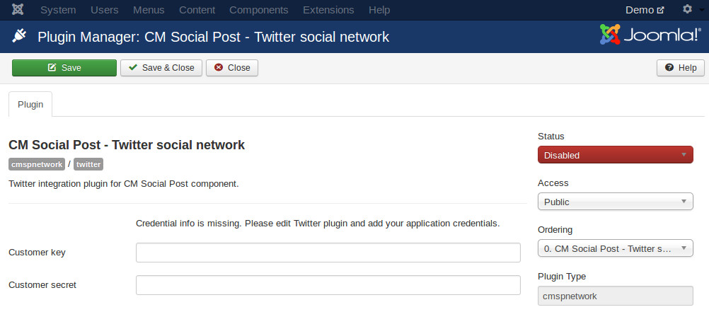
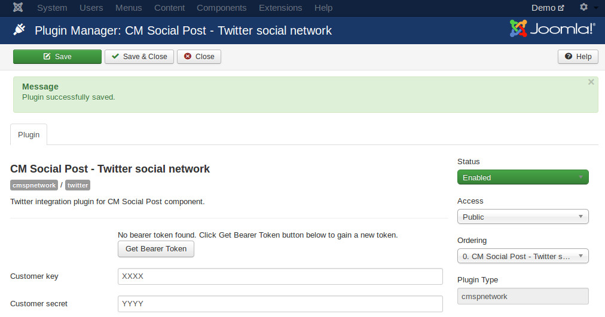
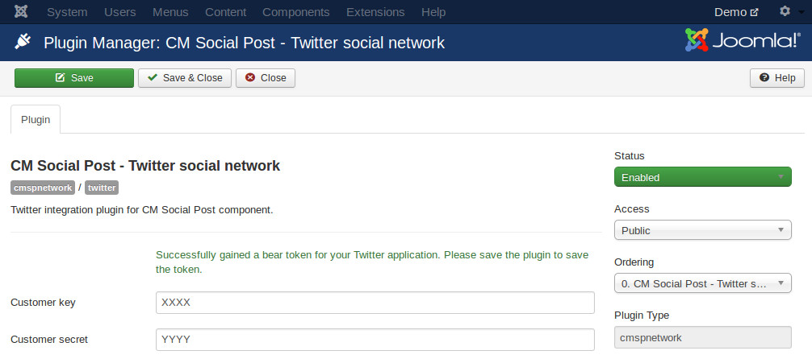

==============
Twitter plugin
==============

In your back-end, go to Extensions -> Plugin, search for "CM Social Post - Twitter social network" plugin.

Edit the plugin, you set "Status" to "Enabled", enter the API key and API secret of your Twitter application then save the plugin.

After saving the plugin, you see a new button "Get Bearer Token", click that button to generate your application's bearer token.

Save the plugin again to save your bearer token.

