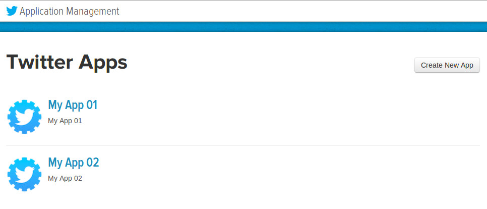
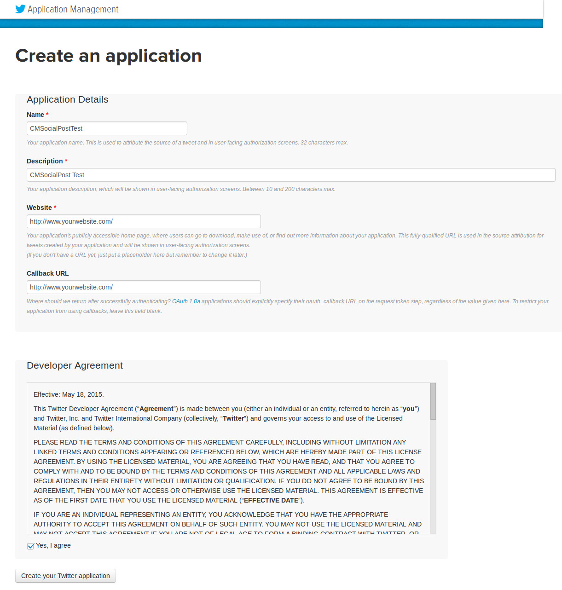
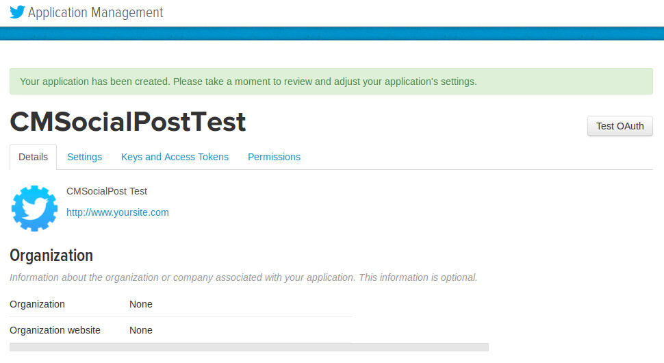
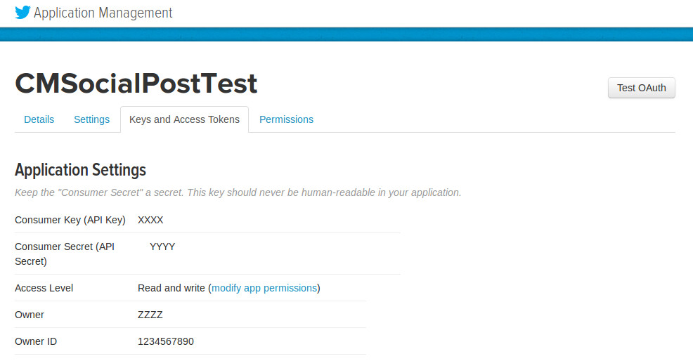

===================
Twitter application
===================

You need to create a Twitter application to be able to tweet to your Twitter accounts. You go to `https://apps.twitter.com/ <https://apps.twitter.com/>`_ to create an application.

1. Click "Create New App".

2. Provide the required information. Ensure you also enter your site URL in Callback URL field, otherwise callback will be disabled and you will get error when connecting to Twitter.

3. After your app is created, click "Keys and Access Tokens" tab to get API key and API secret.

4. Consumer key (or API key), consumer secret (API secret) are the values you need to enter in your Twitter Joomla! plugin.

